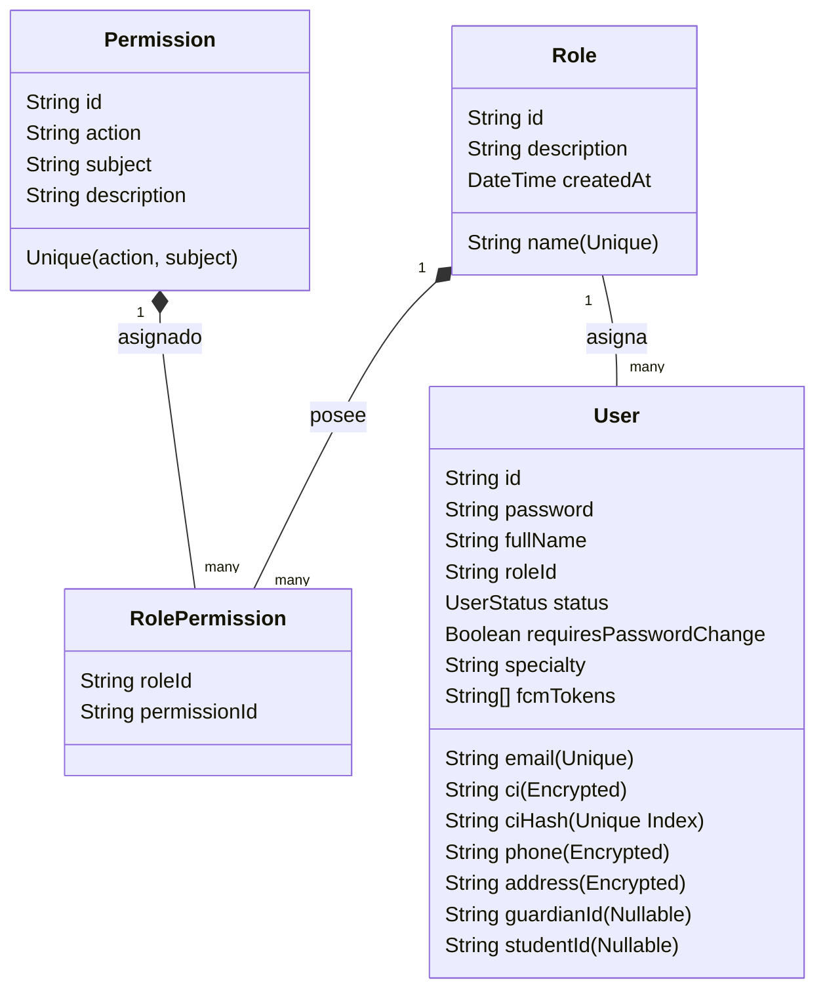
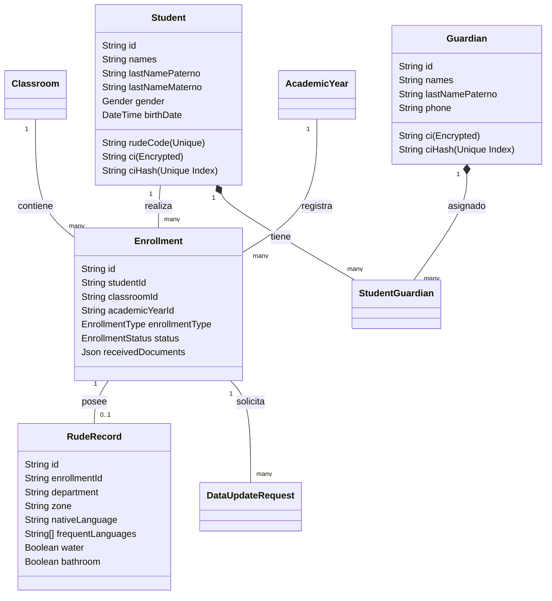

# Mapa de Entidades y Relaciones - UECG Backend

Este documento detalla la estructura lógica de los datos reales del sistema, organizando los modelos de la base de datos (definidos en `schema.prisma`) en pilares de dominio de negocio, detallando sus relaciones y especificando las estrategias de protección de datos sensibles.

---

## 🏗️ Pilares del Dominio de Datos

La base de datos se divide en 5 pilares funcionales y un módulo transversal de auditoría:

```
┌───────────────────────────────────────────────────────────┐
│              1. SEGURIDAD E IDENTIDAD (RBAC)              │
│          Role ── RolePermission ── Permission             │
│                            │                              │
│                          User ── AuditLog                 │
└────────────────────────────┬──────────────────────────────┘
                             │
┌────────────────────────────▼──────────────────────────────┐
│             2. INFRAESTRUCTURA Y CONFIGURACIÓN             │
│        Institution ── PhysicalSpace ── Classroom          │
└────────────────────────────┬──────────────────────────────┘
                             │
┌────────────────────────────▼──────────────────────────────┐
│                 3. ESTRUCTURA ACADÉMICA                   │
│   AcademicYear ─ Subject ─ TeacherAssignment ─ ClassPeriod│
│                            │                              │
│                      ScheduleSlot                         │
└────────────────────────────┬──────────────────────────────┘
                             │
┌────────────────────────────▼──────────────────────────────┐
│           4. ESTUDIANTES E INSCRIPCIONES (RUDE)           │
│      Student ── Enrollment ── Guardian ── RudeRecord      │
│                     │                                     │
│             DataUpdateRequest                             │
└────────────────────────────┬──────────────────────────────┘
                             │
┌────────────────────────────▼──────────────────────────────┐
│            5. OPERACIÓN (CALIFICACIONES/ASISTENCIA)        │
│    Grade ─ GradeChangeRequest ─ AttendanceRecord ─ Trimester│
└───────────────────────────────────────────────────────────┘
```

---

## 1. Módulo de Seguridad e Identidad (RBAC)

Permite definir roles de acceso y permisos dinámicos en el backend para control ABAC.



### Relaciones Clave:
*   `Role` <-> `Permission`: Relación de Muchos a Muchos resuelta mediante la tabla pivote `RolePermission`.
*   `User` -> `Role`: Relación de Muchos a 1 (`roleId` obligatorio).
*   `User` -> `Guardian`: Relación opcional 1:1 (`guardianId`) para usuarios de la aplicación móvil (Padres/Tutores).
*   `User` -> `Student`: Relación opcional 1:1 (`studentId`) para usuarios de la aplicación móvil (Estudiantes).

---

## 2. Módulo de Infraestructura y Configuración

Gestiona la información de la institución educativa y los espacios físicos donde se dictan las clases.

*   **`Institution`:** Almacena el código RUE, dirección geográfica y políticas operativas del colegio (tolerancia de asistencia en minutos, habilitación de QR, etc.).
    *   `directorId` -> `User` (Relación 1:1 opcional para el Director General).
    *   `staff` -> `User`[] (Relación 1:N que lista al personal que trabaja en el colegio).
*   **`PhysicalSpace`:** Representa aulas físicas, laboratorios, canchas u auditorios.
    *   `baseClassrooms` -> `Classroom`[] (Relación 1:N. Si el colegio está en modo `FIXED_BASE`, cada curso tiene asignado un aula física fija).
    *   `scheduleSlots` -> `ScheduleSlot`[] (Relación 1:N que asocia el espacio físico a las clases del horario).

---

## 3. Módulo de Estructura Académica

Configura el calendario lectivo, el plan de asignaturas, la conformación de los cursos del año y la distribución horaria.

*   **`AcademicYear`:** Gestión anual. Contiene fechas de inicio/fin y estado de la gestión.
*   **`Subject`:** Catálogo de materias (ej. Matemáticas). Filtrable por nivel educativo.
*   **`Classroom`:** Curso anual lógico (ej. "Primero A de Secundaria - Mañana").
    *   `academicYearId` -> `AcademicYear` (Pertenece a un año escolar).
    *   `advisorId` -> `User` (1:N, Docente asesor del curso).
    *   `baseRoomId` -> `PhysicalSpace` (1:N opcional, salón físico asignado).
    *   *Constraint:* Unique combinando `[academicYearId, level, grade, section, shift]`.
*   **`TeacherAssignment`:** Carga Horaria de materias.
    *   Relaciona 1 `Classroom`, 1 `Subject` y 1 `User` (Docente).
    *   *Constraint:* Unique `[classroomId, subjectId]`. Un curso solo tiene una carga horaria por asignatura asignada a un docente titular.
*   **`ClassPeriod`:** Períodos fijos de la jornada (ej. 1er Periodo Turno Mañana: 08:00 - 08:40).
*   **`ScheduleSlot`:** La celda horaria persistida.
    *   Relaciona `ClassPeriod`, `TeacherAssignment`, `Classroom`, `User` (Docente) y `PhysicalSpace` (opcional).
    *   *Golden Rule 1 Constraint:* Unique `[classroomId, dayOfWeek, classPeriodId]`.
    *   *Golden Rule 2 Constraint:* Unique `[teacherId, dayOfWeek, classPeriodId]`.

---

## 4. Módulo de Estudiantes e Inscripciones (RUDE)

Lleva el registro de estudiantes, sus tutores legales y el historial de formularios de inscripción y actualizaciones.



### Relaciones Clave:
*   `Student` <-> `Guardian`: Relación de Muchos a Muchos resuelta mediante la tabla de rompimiento `StudentGuardian` que contiene el parentesco (`relationship`: PADRE, MADRE, TUTOR).
*   `Enrollment` -> `RudeRecord`: Relación 1:1. El formulario RUDE está amarrado al evento anual de inscripción.
*   `Enrollment` -> `DataUpdateRequest` (Cuarentena): Relación 1:N que registra las solicitudes de actualización de datos desde la App. Solo puede haber una solicitud `PENDING` por inscripción.

---

## 5. Módulo de Operación (Calificaciones y Asistencia)

Registra la actividad diaria de los cursos durante la gestión activa.

*   **`AttendanceRecord`:** Registro de asistencia diaria.
    *   Relaciona `Enrollment` (Estudiante inscrito), `ClassPeriod` y el Docente que marca la asistencia (`markedById`).
    *   *Constraint:* Unique `[enrollmentId, classPeriodId, date]`. Un estudiante no puede tener doble estado de asistencia para la misma hora y día.
*   **`Trimester`:** Periodo temporal de evaluación del año lectivo (`AcademicYear`).
*   **`Grade`:** Planilla de notas.
    *   Relaciona `Enrollment`, `TeacherAssignment` (Materia/Docente) y `Trimester`.
    *   Registra notas para: `scoreSer` (Max 10), `scoreSaber` (Max 45), `scoreHacer` (Max 40), `scoreAuto` (Max 5).
    *   Campos calculados: `totalScore` (Suma), `recoveryScore` (Reforzamiento), `finalScore` (Nota legal definitiva).
    *   *Constraint:* Unique `[enrollmentId, teacherAssignmentId, trimesterId]`. Solo un registro oficial de notas por alumno/materia/trimestre.
*   **`GradeChangeRequest`:** Solicitud de cambio de calificaciones bloqueadas. Relación 1:N con `Grade`.

---

## 🔐 Estrategia de Protección de Datos Personales (PII)

Para cumplir con políticas de protección de menores y privacidad de datos, el sistema implementa **encriptación a nivel de aplicación** en campos sensibles:

### Campos Afectados:
1.  **`User`:** `ci` (Carnet de Identidad), `phone` (Teléfono) y `address` (Dirección).
2.  **`Student`:** `ci` (Carnet de Identidad).
3.  **`Guardian`:** `ci` (Carnet de Identidad).

### Mecanismo Técnico:
El `EncryptionService` (localizado en `src/common/services/encryption.service.ts`) realiza una encriptación simétrica **AES-256-GCM** antes del almacenamiento. Esto significa que las bases de datos solo almacenan blobs cifrados no legibles.

### Búsqueda indexada sin desencriptación (Blind Index):
Para poder realizar búsquedas exactas (como verificar si un CI ya existe en base de datos para prevenir registros duplicados) sin tener que descifrar toda la tabla en memoria, se utiliza un **Blind Index**:
*   Cada entidad encriptada cuenta con un campo hash correspondiente (ej. `ciHash`).
*   `ciHash` almacena un valor **SHA-256** determinístico derivado del CI original y una clave de sal (salt) fija del sistema.
*   **Validaciones exactas:** Para buscar un usuario por su Carnet `123456`, el sistema calcula `SHA256("123456" + SALT)` y realiza una búsqueda indexada clásica sobre `ciHash` en PostgreSQL.
