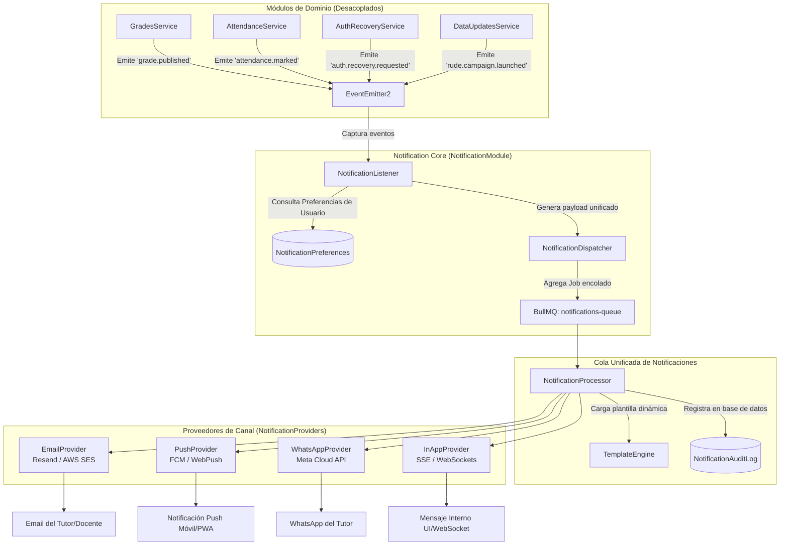
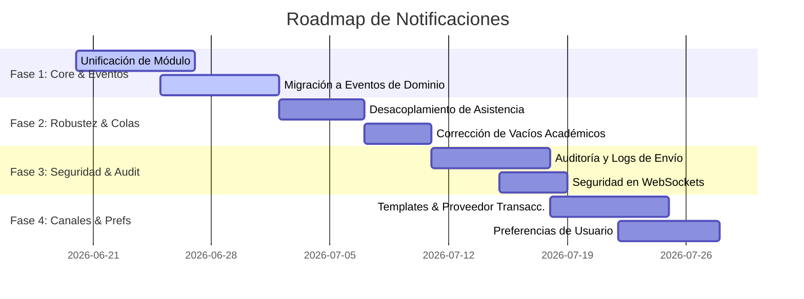

# Auditoría Arquitectónica del Sistema de Notificaciones y Recomendaciones (SaaS Escolar)

**Roles:** Principal Software Architect, Domain Architect, Notification Systems Architect, NestJS Architect, Security Architect, Product Architect.

Este documento presenta una auditoría profunda sobre el estado actual del sistema de comunicaciones y notificaciones del backend de UECG. Diseña una estrategia unificada, escalable, mantenible y segura para convertir la plataforma en un SaaS escolar maduro de alta concurrencia.

---

## 📊 1. Estado Actual y Descubrimientos (Discovery)

El backend de UECG cuenta con implementaciones fragmentadas de notificación que se apoyan en **Firebase Cloud Messaging (FCM)** para notificaciones móviles (tuto/estudiante), **Nodemailer (SMTP)** para correos electrónicos institucionales, **WebSockets (Socket.io)** para avisos de procesamiento en tiempo real en la interfaz administrativa, y la generación de **enlaces semimanuales de WhatsApp** (`api.whatsapp.com`).

A continuación se detallan los canales y tecnologías identificados en el código:

### 1.1 WhatsApp (Semimanual)
*   **Estado:** No existe integración con API oficial ni encolamiento para WhatsApp.
*   **Mecanismo:** El servicio `DataUpdatesBroadcastService` genera un enlace dinámico `https://api.whatsapp.com/send/` agregando el prefijo del país (`591` para Bolivia), limpiando caracteres no numéricos del teléfono del tutor y codificando un texto con un JWT firmado por 7 días que lleva al formulario RUDE digital.
*   **Limitación:** El envío depende enteramente de que un administrador de la secretaría haga clic en un botón en la interfaz de frontend para abrir WhatsApp Web o la App de escritorio.

### 1.2 Email (Nodemailer + Gmail SMTP)
*   **Librería:** `nodemailer` v6.x.
*   **Configuración:** Directamente conectado a un servidor SMTP (Gmail) a través de variables de entorno (`SMTP_USER`, `SMTP_PASS`).
*   **Templates:** Los templates HTML están **hardcodeados inline** en cadenas de texto dentro de `MailService.ts` (`sendPasswordResetEmail` y `sendRudeUpdateEmail`).
*   **Uso asíncrono:** Emplea la cola `mail` de BullMQ (con los jobs `password-reset` y `rude-update-email`) a la cual accede llamando a `MailQueueService`.

### 1.3 Push Notifications (Firebase Admin SDK - FCM)
*   **Librería:** `firebase-admin` v13.x.
*   **Tokens:** Almacenados en una columna array `fcmTokens String[]` en el modelo `User`.
*   **Flujos identificados:**
    1.  **Asistencia:** `AttendanceListener` reacciona a eventos síncronos de `EventEmitter2` (`attendance.*`), extrae los tokens de los tutores asociados al alumno y llama directamente a `FirebaseService.sendMulticastNotification()` de forma síncrona/bloqueante sin usar BullMQ.
    2.  **Alertas de Calificaciones:** `GradesService` (al guardar una nota publicada menor a 51) agrega un job `grade-alert` a la cola `notifications-queue`. El procesador `NotificationsProcessor` resuelve los tokens de los tutores y llama a `FirebaseService`.
    3.  **Campaña RUDE:** `DataUpdatesBroadcastService` agrega el job `push-notification` a la cola `mail` (mezclando responsabilidades de colas). El procesador `MailProcessor` delega en `NotificationService` y éste en `FirebaseService`.
    4.  **Aprobación/Rechazo de RUDE:** `DataUpdatesListener` reacciona a los eventos de aprobación/rechazo de RUDE y llama de forma síncrona a `FirebaseService` sin usar colas.

### 1.4 WebSockets (Realtime In-App)
*   **Motor:** Socket.io con `@nestjs/websockets`.
*   **Mecanismo:** Gateways específicos (`IdentityGateway`, `ReportsGateway`, `TimetablesGateway`) emiten eventos de finalización de exportaciones de archivos ZIP/PDF directamente desde sus respectivos procesadores BullMQ de la cola `export-queue` o `reports-queue`.

---

## 🔍 2. Hallazgos y Auditoría Arquitectónica

La auditoría del código real revela varios riesgos críticos, duplicaciones de lógica y violaciones de arquitectura:

### 2.1 Duplicaciones y Mezclas de Responsabilidades
*   **Nomenclatura e Inconsistencia de Módulos:** Coexisten el módulo plural `NotificationsModule` (cola `notifications-queue` + `NotificationsProcessor` para alertas de notas) y el módulo singular `NotificationModule` (`NotificationService` que envuelve FCM y Mail).
*   **Contaminación de Colas (Cross-Queue Pollution):** La cola `mail` está siendo utilizada para encolar notificaciones Push (`push-notification`) procesadas por `MailProcessor`. Esto rompe el principio de separación de preocupaciones. Si la cola de correos se satura o cae, las notificaciones Push prioritarias se verán retenidas.
*   **Templates de Correo Embebidos:** Los templates HTML para recuperación de contraseña y actualización RUDE están directamente inyectados en el código TypeScript de `MailService.ts`. Cambiar el diseño o un logo requiere recompilar y desplegar el backend.

### 2.2 Acoplamiento Estricto (Tight Coupling)
*   **Inyección Directa de Colas:** `GradesService` (un servicio puramente académico) inyecta directamente la cola de BullMQ (`@InjectQueue('notifications-queue') private notificationsQueue: Queue`) y encola las alertas de reprobación. El dominio de notas conoce directamente los detalles técnicos del transporte de alertas.
*   **Acoplamiento a Firebase en Asistencia:** `AttendanceListener` inyecta directamente `FirebaseService` y realiza llamadas HTTP a la API de Firebase de forma bloqueante. Si la API de Firebase responde lento, degrada el rendimiento de los listeners de eventos.

### 2.3 Gaps de Cobertura en Eventos Académicos
*   **Discrepancia en Alertas de Notas:** Las alertas de rendimiento bajo (< 51) solo se disparan en el método `upsertGrade` (nota individual). Si el docente sube las notas en bloque a través de `updateBulkGrades` o Dirección aprueba una corrección en `resolveChangeRequest`, **no se genera ninguna notificación push** al tutor, a pesar de que la nota final resulte menor a 51 y pase a estado `PUBLISHED`. Esto genera una inconsistencia de negocio severa.

### 2.4 Riesgos de Seguridad e Información Crítica
*   **Falta de Autenticación en WebSockets:** Ninguno de los Gateways (`IdentityGateway`, `ReportsGateway`, `TimetablesGateway`) implementa guards de JWT. Cualquier cliente WebSocket conectado puede escuchar eventos de exportaciones.
*   **Fuga de Datos en Broadcasts:** Los eventos de WebSocket transmiten nombres físicos de archivos ZIP generados en la carpeta `temp-exports/` (que contienen PII de estudiantes y reportes académicos completos). Un atacante podría interceptar estos nombres e intentar su descarga directa por HTTP.
*   **Tokens RUDE sin Expiración Dinámica:** Los tokens generados en `DataUpdatesBroadcastService` son JWT estándar con una duración de 7 días. Si el tutor no actualiza sus datos de inmediato o reenvía el enlace por descuido, la información de PII del estudiante queda expuesta.
*   **Ausencia de Auditoría de Envío:** No existe una tabla o registro en base de datos de las comunicaciones enviadas. El sistema no sabe si un correo OTP rebotó, si una notificación push no llegó por token FCM expirado, o cuántos SMS/WhatsApp se han disparado efectivamente.

---

## 🎯 3. Arquitectura Objetivo (Diseño Conceptual)

Para mitigar los hallazgos y dar soporte a 10,000+ usuarios activos, se propone migrar hacia un **Notification Core** unificado y desacoplado, guiado por eventos de dominio.

### 3.1 Diagrama de Bloques Conceptual



### 3.2 Componentes del Notification Core

1.  **`NotificationModule` unificado:** Fusionará la lógica de colas, procesadores, listeners y servicios de envío en un único módulo global y autocontenido.
2.  **`NotificationListener`:** Se encargará de escuchar todos los eventos del sistema (`attendance.*`, `grade.*`, `auth.*`, `data-update.*`). Ningún servicio académico conocerá la existencia de un email, push o SMS.
3.  **`NotificationPreferences` (Preferencias de Usuario):** Se introduce una relación en la base de datos (ej. `UserPreference`) para que los usuarios finales configuren qué notificaciones desean recibir y por qué canales.
    ```prisma
    model UserPreference {
      id             String   @id @default(uuid())
      userId         String   @unique @map("user_id")
      user           User     @relation(fields: [userId], references: [id], onDelete: Cascade)
      allowPush      Boolean  @default(true) @map("allow_push")
      allowEmail     Boolean  @default(true) @map("allow_email")
      allowWhatsApp  Boolean  @default(false) @map("allow_whatsapp")
      
      @@map("user_preferences")
    }
    ```
4.  **`NotificationDispatcher`:** Servicio centralizado que evalúa el evento de negocio, consulta las preferencias del usuario y decide a qué cola o canal despachar la comunicación.
5.  **`NotificationProvider` (Patrón Strategy):** Interfaz genérica para la entrega de mensajes:
    ```typescript
    interface NotificationProvider {
      send(recipient: string, payload: any): Promise<boolean>;
    }
    ```
    Existirá un provider concreto por canal (`EmailProvider`, `WhatsAppProvider`, `PushProvider`, `InAppProvider`), permitiendo cambiar de proveedor externo (ej. de Nodemailer a Resend o de Twilio a WhatsApp Cloud API) sin alterar el core del sistema.
6.  **`TemplateEngine`:** Separador lógico de plantillas. Hará uso de un compilador de plantillas (ej. Handlebars o EJS) alojado en el sistema de archivos (`src/notifications/templates/*.hbs`) o integrado con un generador de correos reactivo (ej. React-Email) facilitando la internacionalización, el soporte multi-idioma y el formato responsive.
7.  **`NotificationAuditLog` (Auditoría de Envíos):** Modelo para registrar la trazabilidad de las comunicaciones, vital para validar ante los directivos que el tutor fue notificado:
    ```prisma
    model NotificationLog {
      id           String             @id @default(uuid())
      recipientId  String             @map("recipient_id")
      channel      NotificationChannel
      status       DeliveryStatus     // SENT, DELIVERED, FAILED, RETRYING
      payload      Json
      errorMessage String?            @map("error_message")
      attempts     Int                @default(1)
      createdAt    DateTime           @default(now()) @map("created_at")
      updatedAt    DateTime           @updatedAt @map("updated_at")
      
      @@map("notification_logs")
    }
    ```

---

## 📈 4. Canales Actuales y Futuros

### 4.1 WhatsApp (Evolución a API Oficial)
*   **Enfoque Actual:** Enlaces dinámicos semimanuales.
*   **Propuesta:** Integrar **WhatsApp Cloud API (Meta Business)**.
    *   *Costos:* Meta otorga 1,000 conversaciones iniciadas por el usuario al mes gratis. Las conversaciones iniciadas por la institución (ej. alertas académicas o RUDE) tienen un costo unitario regulado por país (aprox. $0.05 USD en LATAM).
    *   *Limitaciones:* Requiere verificación del negocio en Meta Business Manager y uso exclusivo de plantillas (`Templates`) aprobadas previamente por Meta. Las notificaciones dinámicas libres no están permitidas en conversaciones iniciadas por la app.
    *   *Viabilidad:* Alta para avisos administrativos de inscripción y alertas de inasistencia críticas.

### 4.2 Email (Migración a Proveedor Transaccional)
*   **Enfoque Actual:** Nodemailer con Gmail SMTP.
*   **Propuesta:** Migrar a **Resend** o **Amazon SES**.
    *   *Entregabilidad:* IPs dedicadas o compartidas de alta reputación. Implementación obligatoria de firmas SPF, DKIM y políticas DMARC en el dominio del colegio para evitar que las alertas terminen en la carpeta de Spam.
    *   *Auditoría:* Configurar webhooks para capturar eventos de entrega, rebotes (bounces) y aperturas de correos en tiempo real, actualizando la tabla `NotificationLog`.

### 4.3 Push Notifications (FCM PWA y Web Push)
*   **Enfoque Actual:** FCM Multicast con tokens de dispositivos de la App móvil.
*   **Propuesta:** Expandir a **Web Push (PWA)** en navegadores de escritorio y móviles.
    *   *Viabilidad:* Altísima y costo cero.
    *   *Impacto en UX:* Avisa instantáneamente sobre el ingreso del alumno directamente en la computadora de la oficina o el celular del padre de familia, sin requerir la descarga obligatoria de la App desde Google Play o App Store.

---

## 🚀 5. Roadmap Recomendado de Implementación

Para asegurar una transición robusta sin regresiones ni cortes de servicio, se plantea un roadmap dividido en 4 fases ordenadas por prioridad de impacto y complejidad técnica:



### Fase 1: Unificación de Módulo y Eventos (Prioridad Alta)
1.  **Unificar módulos:** Consolidar `NotificationsModule` y `NotificationModule` en un único `NotificationModule` en `src/notifications/`.
2.  **Migrar a Bus de Eventos:** Remover la inyección directa de BullMQ en `GradesService` y el acoplamiento directo de `FirebaseService` en `DataUpdatesListener`. Configurar listeners específicos en `NotificationModule` para reaccionar a los eventos emitidos por el negocio.

### Fase 2: Robustez y Desacoplamiento (Prioridad Alta)
3.  **Desacoplar Asistencia (BullMQ):** Modificar el listener de asistencia (`AttendanceListener`) para que en lugar de invocar de manera síncrona el FCM, agregue la tarea de notificación a la cola de BullMQ. Esto evita saturar el Event Loop ante marcas simultáneas de miles de estudiantes.
4.  **Resolver el Gap Académico:** Modificar `GradesService` para que emita un evento de dominio genérico `grade.published` tanto en `upsertGrade` (individual), como en `updateBulkGrades` (masiva) y `resolveChangeRequest` (descongelamiento de notas). El listener de notificaciones decidirá de manera centralizada si el estudiante reprobó (< 51) y requiere alertar al tutor.

### Fase 3: Seguridad y Trazabilidad (Prioridad Media)
5.  **Tabla de Auditoría de Comunicaciones:** Diseñar e implementar el modelo `NotificationLog` en Prisma para almacenar un historial y estado real de cada mensaje enviado.
6.  **Protección de WebSockets:** Integrar `JwtAuthGuard` en los Gateways de WebSockets y asegurar que las notificaciones de exportación (`export-reports-ready-${userId}`) se emitan únicamente a salas privadas del usuario autenticado, resolviendo el bug del `userId = undefined`.

### Fase 4: Optimización de Canales y Preferencias (Prioridad Media)
7.  **Template Engine Externo:** Extraer los HTML inlined a archivos independientes `.hbs` e implementar un servicio de renderizado dinámico.
8.  **Cambio de SMTP a API Transaccional:** Remplazar el transporte Gmail de Nodemailer por la integración con Resend o AWS SES a través del patrón Strategy.
9.  **Preferencias del Tutor:** Agregar el formulario de configuración de canales preferidos por el usuario en la interfaz del tutor, enlazado al modelo `UserPreference`.

---

## ⚖️ 6. Riesgos y Beneficios de la Arquitectura Objetivo

### Riesgos y Mitigaciones
*   **Riesgo de Sobrecarga de Redis:** Al procesar miles de notificaciones encoladas (especialmente a las 8:00 AM), la RAM del servidor Redis podría dispararse si los jobs finalizados no se eliminan.
    *   *Mitigación:* Usar la opción `removeOnComplete: true` o limitar el historial de logs completados a un número máximo (`removeOnComplete: 50`) en las opciones por defecto de BullMQ.
*   **Costos Operativos de WhatsApp:** Automatizar WhatsApp con Meta Business Platform puede elevar los costos mensuales del colegio si no se controla el volumen de mensajes.
    *   *Mitigación:* Limitar las notificaciones por WhatsApp a alertas críticas (ausencias injustificadas, citaciones a dirección) y dejar los reportes diarios o notas mensuales para Push y Email.
*   **Caducidad de Tokens FCM:** Los usuarios que desinstalan la App o limpian caché dejan tokens huérfanos. FCM responderá con errores `messaging/registration-token-not-registered`.
    *   *Mitigación:* El procesador BullMQ debe capturar el error de token inválido devuelto por Firebase y eliminarlo automáticamente del array `fcmTokens` del usuario en la base de datos.

### Beneficios Obtenidos
*   **Desacoplamiento Total (SRP - Single Responsibility Principle):** Los desarrolladores del módulo académico solo se preocupan de la lógica académica (grados, asistencia, RUDE). Si el canal de comunicación cambia de proveedor o se añade uno nuevo (ej. SMS), el dominio académico no sufre cambios.
*   **Escalabilidad Exponencial:** Al transferir todo el peso de las llamadas de red (Firebase, SMTP, Meta API) a hilos/procesos secundarios administrados por BullMQ, el servidor NestJS principal permanece libre y ligero para responder consultas HTTP de manera inmediata.
*   **Trazabilidad Legal:** La Unidad Educativa contará con un registro inmutable en base de datos que demuestra el envío y recepción de correos de recuperación, notificaciones de atraso y alertas de inasistencia, sirviendo como respaldo administrativo.
*   **Ahorro de Costos Inteligente:** El sistema seleccionará dinámicamente el canal más económico activo (ej. prioriza Push PWA que es gratis, si no hay token envía Email, y si es urgente y no hay lectura, recurre a WhatsApp/SMS).
