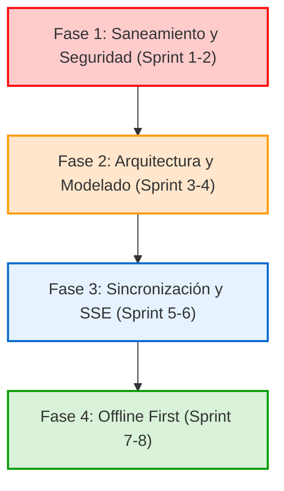

# Estado Actual del Proyecto Móvil UECG

Este documento contiene un análisis arquitectónico completo y diagnóstico del estado actual del repositorio Flutter de la **U.E. Ernesto Che Guevara (UECG)**.

---

## 1. Módulos Existentes y Estado

El proyecto actual cuenta con una estructura inicial orientada a Clean Architecture, pero implementada parcialmente (con las carpetas creadas pero mayormente vacías de lógica de negocio o modelos de dominio reales).

| Módulo | Tipo | Estado | Archivos Principales | Descripción |
| :--- | :--- | :--- | :--- | :--- |
| **Onboarding** | Presentación | Completo (Mock) | [splash_screen.dart](file:///home/daniel/AndroidStudioProjects/uecg_app/lib/features/onboarding/presentation/screens/splash_screen.dart) [onboarding_screen.dart](file:///home/daniel/AndroidStudioProjects/uecg_app/lib/features/onboarding/presentation/screens/onboarding_screen.dart) [welcome_screen.dart](file:///home/daniel/AndroidStudioProjects/uecg_app/lib/features/onboarding/presentation/screens/welcome_screen.dart) | Secuencia de presentación institucional con animaciones suizas (`flutter_animate`) y redirección a login/paneles basados en roles. |
| **Auth** | Datos & Presentación | Funcional (Conectado) | [auth_repository.dart](file:///home/daniel/AndroidStudioProjects/uecg_app/lib/features/auth/data/auth_repository.dart) [auth_provider.dart](file:///home/daniel/AndroidStudioProjects/uecg_app/lib/features/auth/presentation/providers/auth_provider.dart) [login_screen.dart](file:///home/daniel/AndroidStudioProjects/uecg_app/lib/features/auth/presentation/screens/login_screen.dart) [register_screen.dart](file:///home/daniel/AndroidStudioProjects/uecg_app/lib/features/auth/presentation/screens/register_screen.dart) | Pantallas de Login y Registro para Estudiante y Tutor/Padre. Gestión de recuperación de contraseñas. Almacenamiento seguro del JWT mediante Secure Storage. |
| **Dashboard** | Presentación | Estático (Mock UI) | [student_dashboard.dart](file:///home/daniel/AndroidStudioProjects/uecg_app/lib/features/dashboard/presentation/screens/student_dashboard.dart) [parent_dashboard.dart](file:///home/daniel/AndroidStudioProjects/uecg_app/lib/features/dashboard/presentation/screens/parent_dashboard.dart) [teacher_dashboard.dart](file:///home/daniel/AndroidStudioProjects/uecg_app/lib/features/dashboard/presentation/screens/teacher_dashboard.dart) | Contenedores de vistas por rol (`IndexedStack`) para estudiantes, padres/tutores y docentes. |
| **Asistencia QR** | Presentación | Experimental (Local) | [qr_attendance_screen.dart](file:///home/daniel/AndroidStudioProjects/uecg_app/lib/features/dashboard/presentation/screens/qr_attendance_screen.dart) | Lector de códigos de barra y QR con `mobile_scanner`. Almacena registros escaneados en una lista local en memoria sin persistencia ni envío al backend. |

---

## 2. Módulos Faltantes (Gaps)

Para lograr paridad de funcionalidad con el backend NestJS y la aplicación web React actual, es necesario desarrollar los siguientes componentes:

1. **Perfil y Gestión de Familiares (Real)**:
   - El perfil de tutor (`ParentProfileView`), estudiante (`StudentProfileView`) y docente (`TeacherProfileView`) actualmente muestran datos estáticos (por ejemplo, "Juan Pérez", "María Pérez").
   - Falta conectar con el endpoint del backend `/guardians/me` y `/students/me` para listar los familiares reales asociados en la base de datos de NestJS.
2. **Registro de Asistencia y Reportes (Real)**:
   - Envío de registros escaneados desde `QRAttendanceScreen` al backend mediante un servicio/repositorio de asistencia.
   - Panel de reportes de faltas y atrasos históricos para padres y estudiantes.
3. **Centro de Mensajería y Notificaciones**:
   - Bandeja de entrada de comunicados institucionales y chat/mensajes (de la tabla de mensajes o base de datos del backend).
   - Historial de notificaciones push recibidas.
4. **Módulo de Calificaciones y Horarios (Real)**:
   - Sincronización de calificaciones parciales y finales por materia y bimestre/trimestre.
   - Sincronización y caché offline del calendario escolar y horario de clases semanal.
5. **Canal de Sincronización en Tiempo Real (SSE)**:
   - Integración con el sistema Server-Sent Events (SSE) del backend NestJS para recibir actualizaciones inmediatas de asistencia, alertas de comportamiento o comunicados de dirección en primer plano.

---

## 3. Integración con el Backend Actual

La integración con el backend NestJS se centraliza en:
* **Endpoint Base**: `https://ue-cheguevara-backend-1.onrender.com/api/v1` (Render).
* **Gestión de Sesión**:
  - Al hacer login/registro, NestJS devuelve un JWT que el cliente guarda en `FlutterSecureStorage` con la clave `uecg_jwt_token`.
  - El token se adjunta automáticamente a las cabeceras `Authorization: Bearer <token>` de las llamadas de Dio gracias a un interceptor en `ApiClient`.
* **Token FCM (Notificaciones Push)**:
  - Durante el login o el registro, la aplicación móvil obtiene un token de Firebase Cloud Messaging (FCM) y llama a `/auth/fcm-token` para guardarlo en la cuenta del usuario en NestJS.
  - La rotación del token de Firebase mediante `FirebaseMessaging.onTokenRefresh` está controlada en `PushNotificationService`, el cual llama a `AuthRepository.syncFcmToken` cuando el token cambia en segundo plano.

---

## 4. Deuda Técnica Identificada

1. **Instanciación Repetitiva del Cliente HTTP (`ApiClient.dio`)**:
   - `ApiClient.dio` está programado como un getter estático que instancia una nueva clase `Dio` y le inyecta un nuevo interceptor cada vez que se invoca.
   - **Consecuencia**: Fuga de recursos, pérdida del pool de conexiones HTTP, y degradación del rendimiento por recreación constante del cliente.
2. **Cierre de Sesión Incompleto (Fuga de Seguridad)**:
   - En las pantallas de perfil, el botón de cerrar sesión simplemente redirige de forma forzada a `/welcome` usando `context.go('/welcome')`.
   - **Consecuencia**: El token JWT *no se borra* de `SecureStorageService` y el estado del `authProvider` sigue marcado como `authenticated`. Si el usuario reinicia la app, el Splash Screen leerá el token persistente e iniciará sesión automáticamente de nuevo.
3. **Manejo Estático de Servicios y Repositorios**:
   - `AuthRepository` y `PushNotificationService` se instancian directamente en constructores u operaciones estáticas.
   - **Consecuencia**: Alto acoplamiento. Se impide la inyección de dependencias falsa (mocks) durante pruebas unitarias o de widgets.
4. **Falta de Tipado de Datos (Domain Models / DTOs)**:
   - Los datos del usuario y los perfiles se manejan a través de mapas genéricos `Map<String, dynamic>`.
   - **Consecuencia**: Vulnerabilidad a errores tipográficos en claves de JSON y falta de robustez en tiempo de compilación.
5. **Suite de Pruebas Rota**:
   - El archivo autogenerado `test/widget_test.dart` hace referencia a `MyApp`, una clase que no existe en `lib/main.dart` (donde se llama `UECGApp`).
   - **Consecuencia**: El comando `flutter test` falla al ejecutarse, impidiendo el uso de pipelines de CI/CD.

---

## 5. Riesgos Arquitectónicos y de Seguridad

> [!CAUTION]
> **Fuga de Credenciales por Cierre de Sesión Simulado**:
> Un usuario que hace "clic" en cerrar sesión asume que su cuenta está protegida. Sin embargo, dado que el token JWT no se destruye en el almacenamiento físico, cualquier persona con acceso físico al dispositivo puede restaurar la app o interceptar peticiones con el token aún activo.

> [!WARNING]
> **Bloqueo del Hilo Principal por Lógica en UI (Splash Screen)**:
> El Splash Screen ejecuta una secuencia de animaciones basadas en retrasos fijos de tiempo (`Future.delayed`) seguidos de navegación forzada. Si la red responde tarde durante `refreshProfile()`, la pantalla se congelará en el Splash o cambiará de estado de manera impredecible en mitad de una animación.

---

## 6. Roadmap Móvil Sugerido (Fases)

### Fase 1: Saneamiento y Seguridad (Sprint 1-2)
* Corregir el botón "Cerrar Sesión" en las tres vistas de perfil (`parent`, `student`, `teacher`) para invocar de verdad a `ref.read(authProvider.notifier).logout()`.
* Refactorizar `ApiClient` para exponer una única instancia única (Singleton) de `Dio` mediante Riverpod (`@riverpod dioClient`).
* Solucionar la prueba `test/widget_test.dart` para compilar con `UECGApp` y añadir análisis estricto en `analysis_options.yaml`.

### Fase 2: Arquitectura y Modelado (Sprint 3-4)
* Crear la capa de **Domain Models** para `User`, `Student`, `Guardian`, `Course`, `AttendanceRecord` y `Message` usando `@freezed` para inmutabilidad y deserialización segura.
* Implementar **GoRouter Redirects** centralizados vinculados al estado de `authProvider`, eliminando la navegación manual de roles desde los widgets de pantallas.

### Fase 3: Sincronización y SSE (Sprint 5-6)
* Desarrollar la conexión de Server-Sent Events (SSE) en un servicio persistente (`SseClientService`) para alertar al usuario sobre eventos de asistencia en tiempo real.
* Integrar la subida real del escaneo de QR de asistencia en `QRAttendanceScreen` al NestJS Backend.

### Fase 4: Offline First (Sprint 7-8)
* Implementar una base de datos local embebida (Hive o Isar) para almacenar el perfil, horario escolar, y calificaciones.
* Diseñar una cola de operaciones offline para acumular asistencias escaneadas por el docente cuando no tenga conectividad a internet, sincronizando automáticamente en segundo plano al recuperar red.
