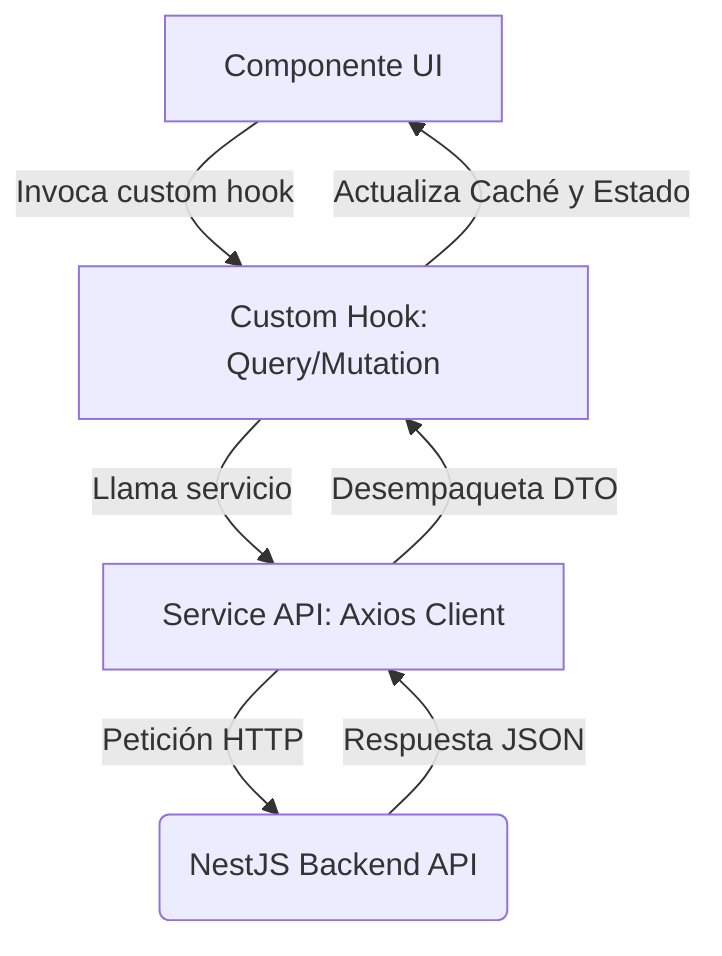

# Flujo de Datos - UECG React Vite

Este documento describe el flujo de datos y el ciclo de vida de la información en el frontend de la aplicación.

## 1. Ciclo de Vida de Peticiones y Respuestas

El flujo de comunicación entre el frontend y el backend sigue una tubería unireccional estricta:



---

## 2. Estrategia de Consultas (Queries) y Paginación

* **Declaración:** Las consultas de datos se realizan a través de custom hooks dedicados (ej. `useAcademicYearsData`).
* **Debounce de Búsquedas:** Cualquier filtrado o búsqueda por texto debe retrasarse con un debounce (ej. `useDebounce` con `500ms`) antes de disparar la consulta de Query para evitar ráfagas de peticiones innecesarias al servidor.
* **Placeholder de Datos:** Al paginar, se debe usar `placeholderData: (previousData) => previousData` en TanStack Query para evitar parpadeos visuales en la transición de páginas.

---

## 3. Estrategia de Mutaciones e Invalidación de Caché

Las mutaciones modifican datos en el servidor y requieren una sincronización rigurosa de la interfaz de usuario:

```typescript
// Ejemplo de patrón correcto en custom hook de mutación
const mutation = useMutation({
  mutationFn: (payload: PayloadType) => Service.create(payload),
  onSuccess: () => {
    toast.success("OPERACIÓN COMPLETADA CON ÉXITO");
    // Invalidamos cachés específicos relacionados para refrescar en segundo plano
    queryClient.invalidateQueries({ queryKey: ["academicYears"] });
    queryClient.invalidateQueries({ queryKey: ["currentAcademicYear"] });
  },
  onError: (error: any) => {
    const message = error.response?.data?.message || "Ocurrió un error en el servidor";
    toast.error(typeof message === "string" ? message : message[0]);
  }
});
```

### Reglas de Sincronización
1. **Invalidación Colectiva:** Siempre se debe invalidar las `queryKey` relacionadas en el bloque `onSuccess` de la mutación.
2. **Prohibición de Caché Manual:** Queda prohibido modificar el caché directamente con `queryClient.setQueryData` a menos que sea para una actualización optimista (*optimistic update*) formalmente controlada y respaldada por una mutación real.
3. **Manejo de Errores de API:** Los errores devueltos por NestJS suelen estructurarse como objetos o arreglos de strings en `message`. La captura debe normalizarse para admitir tanto textos planos como arreglos de validación.

---

## 4. Normalización DTO de NestJS

El backend (NestJS) a menudo devuelve datos envueltos en objetos con una propiedad raíz `.data` o metadatos de paginación `.meta`.
* **Desempaquetado Seguro:** Los métodos de los servicios de API (`[feature].service.ts`) deben comprobar de forma segura si la respuesta viene envuelta en `.data` y extraerla:
  ```typescript
  return response.data.data !== undefined ? response.data.data : response.data
  ```
* **Garantía en Hooks:** El custom hook receptor debe garantizar que la variable expuesta sea un arreglo puro u objeto tipado, defendiéndose de respuestas mal estructuradas o nulas:
  ```typescript
  const items = Array.isArray(queryResponse?.data) ? queryResponse.data : []
  ```
